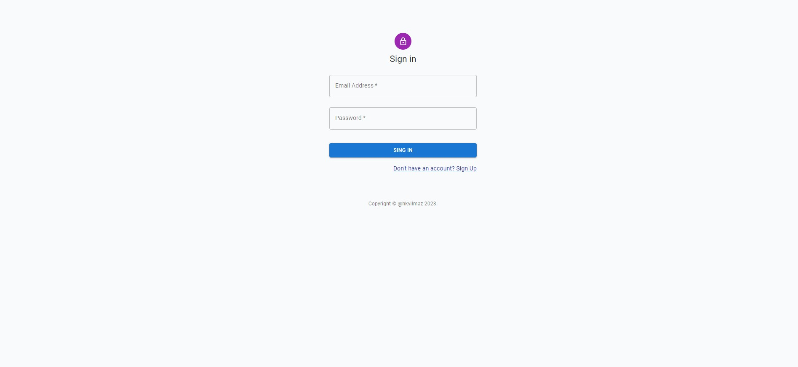
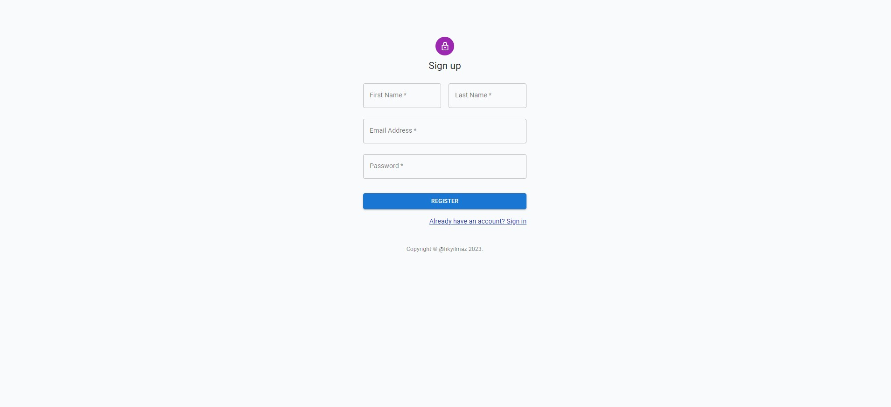
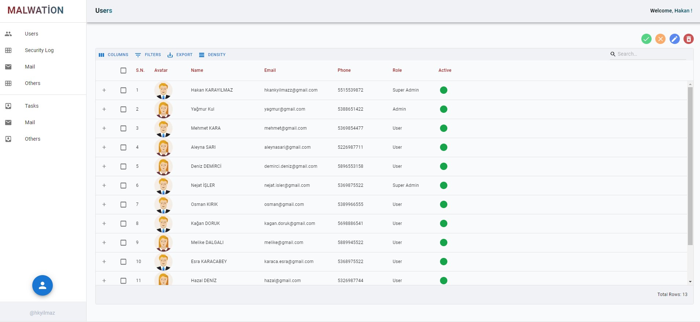
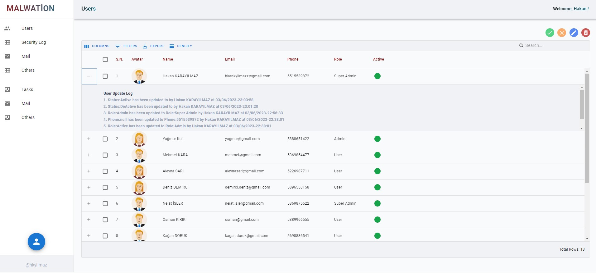
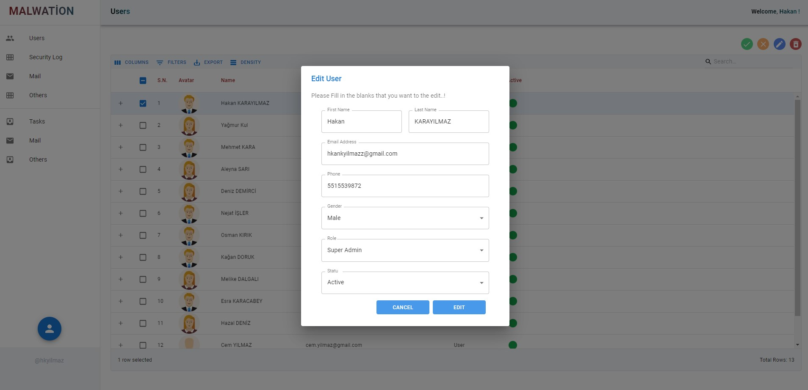
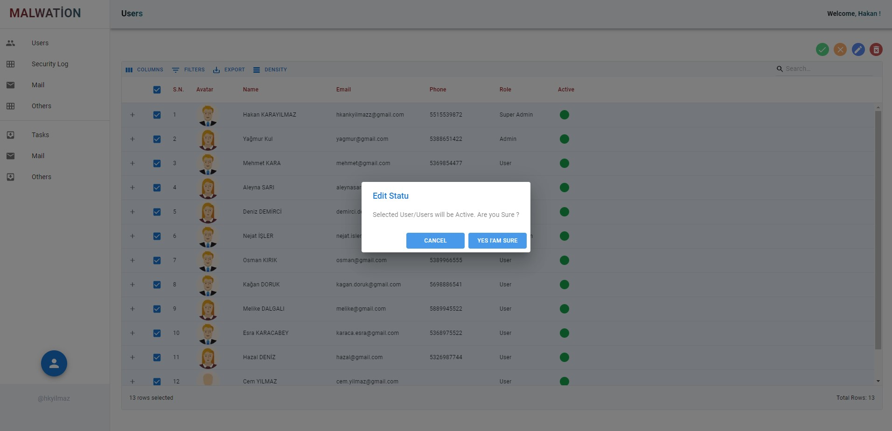
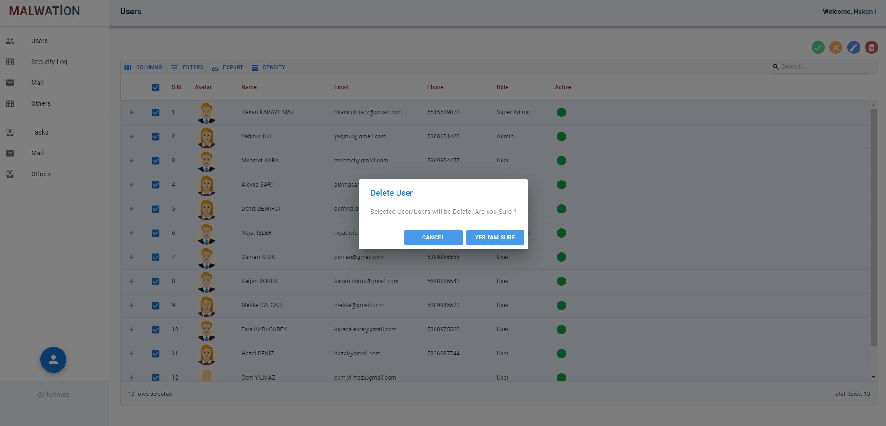
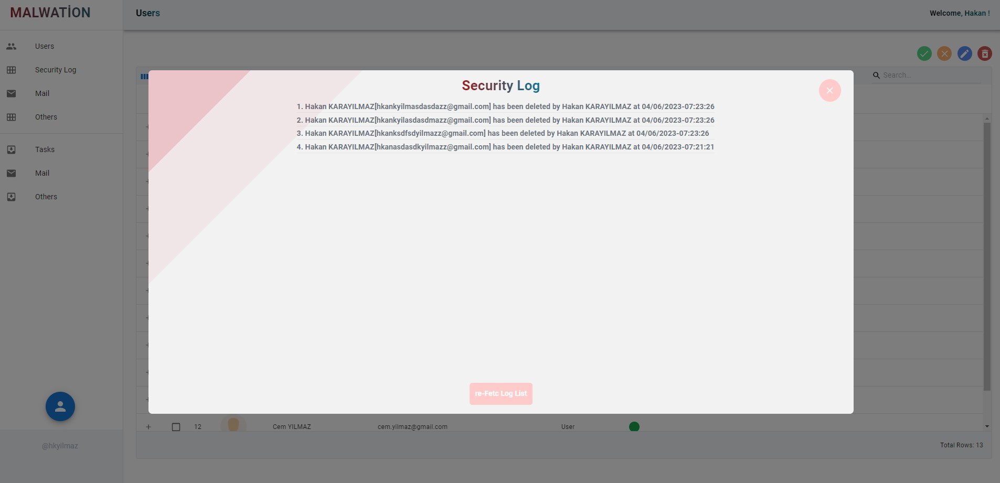
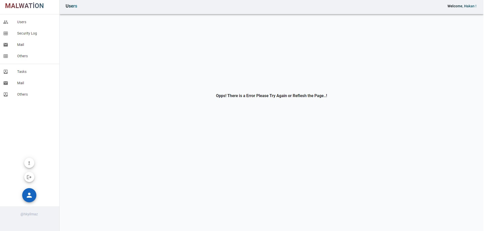

<h2 align="center">🏆 MALWATİON HİRİNG CASE 🏆</h2>
<hr>
<br>

<div align="center">
    <a href="#" target="blank" title="malwation" >PROJECT WEBSITE</a>
</div>
 
<br>
<br>
<h2 align="center">🧱 ABOUT PROJECT 🧱</h2>
<hr>
<br>

- This project is a hiring intership program prepared by [Malwation](https://malwation.com/) on application development.
- Case is wep application about users list that have different functionality.
- There are two case for this program that frontend web development and backend web development.
- My case includes two options.So My app is Full-Stack web development [ MERN Stack (Next.js) ].

<br>
<br>
<h2 align="center">📚 LIBRARIES 📚</h2>
<hr>
<br>

<h2> Frontend 🔥 </h2>
<br>

✔️ [redux-toolkit](https://redux-toolkit.js.org/) --> Client Side State Management <br>
✔️ [redux-toolkit-query](https://redux-toolkit.js.org/) --> Server Side State Management <br>
✔️ [next-auth](https://next-auth.js.org/) --> Authentication <br>
✔️ [react-hook-form](https://react-hook-form.com/) --> Management Form Action and Validations <br>
✔️ [validator](https://www.npmjs.com/package/validator) --> Form Validations <br>
✔️ [dayjs](https://day.js.org/) --> Handling Time and Date <br>
✔️ [tailwindcss](https://tailwindcss.com/) --> Handling Styling<br>
✔️ [meterial-ui](https://mui.com/) --> User Interface <br>
✔️ [gsap](https://greensock.com/gsap/) --> Awesome Animation <br>
✔️ [react-toastif](https://fkhadra.github.io/react-toastify/introduction) --> Feedback <br>

<br>

<h2> Backend 🚀 </h2>
<br>

✔️ [express](https://expressjs.com/) --> Node.js Framework <br>
✔️ [mongoose](https://mongoosejs.com/) --> MangoDB Object Modeling <br>
✔️ [nodemon](https://www.npmjs.com/package/nodemon) --> Automaticaly Restarting <br>
✔️ [bcryptjs](https://www.npmjs.com/package/bcryptjs) --> Encryption, crtpt <br>
✔️ [cors](https://www.npmjs.com/package/cors) --> CORS <br>
✔️ [meterial-ui](https://mui.com/) --> User Interface <br>
✔️ [jsonwebtoken](https://jwt.io/) --> Web Token <br>
✔️ [mangoDB](https://www.mongodb.com/atlas/database) --> Database [No libary :)]<br>

<br>
<br>
<h2 align="center">🔎 PROJECT OVERVIEW 🔎</h2>
<hr>
<br>

<h3 align="left">General Info</h3>
<hr> 

The user should be able to make the following entries

- Name
- Email
- Password
- Role,Gender,Status

Goal

- Taking the above information from the user as input in a form
- Create User Account by registering information to the database
- Update User Account by registering information to the database
- Delete User Account by removing information in the database

Project Details

- Tailwindcss, pure css and metarial ui built in css-styles features is used for css edits.
- It is designed as a single page application.
- Next.js is used for Frontend web development, Next Auth is used for Auth process.
- There are 3 (three) page. Main page, login page and register page.
- Login page has a animation that trigger with mouse scroling.
    * User must scroling to reach to login form.
<br>
<br>
   
<br>
<br>
- User need to scroling to reach login form when in the login route.
- There are one main custom component (Forms.js)  file that contains 4 form component and Icon Component.
- Also in some files has micro components.
- Login process implements via next.js built-in api routes.
- App has protected routes.
    * if User has not session (via next auth) user will re-direct to login page.
    * if User has session (via next auth) user will re-direct to main page. 
- Other process about database implements via node.js server.
- There are function that able to auth process in the server but theese are inactive.( Next auth used).
    * These can be activated İf desired.
- When user account createted The password firstly hashed and after registered.

<br>
<h3 align="left">Features</h3>
<hr>

- There two button for change to user status without open the update dialog.. (Active/DeActive)
- User can multiple update accounts status at the same time.
- User can multiple delete account at the same time.
- User can update one account at the same time.
- Log is created after Each CRUD operation. 
- When user registered some features default assigned. (role:User , status:"Active")
- Each account has a log about CRUD process.
- Each Form has a validation and error message (dynamicly).
- In case of clicking on a different address, a 404 not found page is shown to the user.
- Each user have a avatar depand on your gender.If User dont specify your gender unknown avatar  will be assigned to user.
- User list is refetched after Each update process.
- There are user interface that show api request is contiuning. ( loading , spinner)

<br>
<h3 align="left">Restricts</h3>
<hr>

- CRUD buttons are inactive if user dont select the user account row.
    * "Active" action button (first button) will be active if user select minumum one row.
    * "Inactive" action button (second button) will be active if user select minumum one row.
    * "Update" action button (third button) will be active if user just one row.
    * "Delete" action button (fourth button) will be active if user select minumum one row.
<br>
<br>
   
<br>
<br>

- User dont CRUD process İf user's role is "User" (excluding own info). /** This features removed it can be enabled if desired - Each user can crud process - */ 
    * User can edit your info via Edit Info button.
<br>
<br>
   
<br>
<br>
     
- Just "Super Admin" see the account's log. /** This features removed it can be enabled if desired  - Each user can see logs - */
    * There are two log list.First list is "updated users" logs and second list is "deleted users" logs.
<br>
<br>
   
<br>
<br>
<br>
<br>
   
<br>
<br>       
- İf user want to register user must specify strong password and email that already have not registered.
<br>
<br>
     
<br>
<br> 

<br>
<h3 align="left">Deployment</h3>
<hr>

This is a [Next.js](https://nextjs.org/) project bootstrapped with [`create-next-app`](https://github.com/vercel/next.js/tree/canary/packages/create-next-app).

## 💻 Setup <br>

### Install Dependencies

```
npm install
```

### Run the App in the Dev Server

```
  npm install --save
  npm run dev
```

### to Build for Production

```
npm build
```


<br>
<h2 align="center">📽️ PROJECT PICTURES 📽️</h2>
<hr>
<br>

<br>
     
<br>
<br> 
<br>
      
<br>
<br> 
<br>
    
<br>
<br> 
<br>
     
<br>
<br> 
<br>
     
<br>
<br> 
<br>
     
<br>
<br> 
<br>
      
<br>
<br> 
<br>
      
<br>
<br> 
<br>
    
<br>
<br> 
